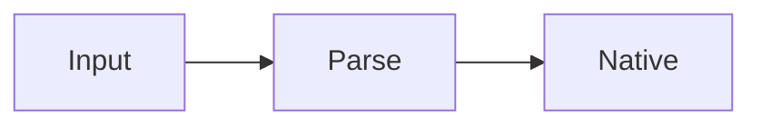

# Native streaming benchmark

This corpus mixes **emphasis**, _style_, [safe links](https://example.com), inline `code`, and an image fallback.

- [x] completed task
- [ ] pending task
- nested
  - list

| Package | Platform | Status |
|---|---|---:|
| streamdown-rn | iOS | ready |
| streamdown-rn | Android | ready |

```typescript title="stream.ts"
export function append(previous: string, chunk: string) {
  return previous + chunk;
}
```

> Stable blocks must not rerender while the active tail grows.

Inline math $x^2 + y^2$ remains readable without an adapter.

$$
\sum_{i=1}^{n} i = \frac{n(n+1)}{2}
$$



中文**强调**，日本語の文章、한국어 문장입니다。

مرحبا بالعالم، هذا نص من اليمين إلى اليسار.

<widget>{"state":"safe"}</widget>

The final construct is intentionally incomplete for streaming repair: [reference](https://example.com
