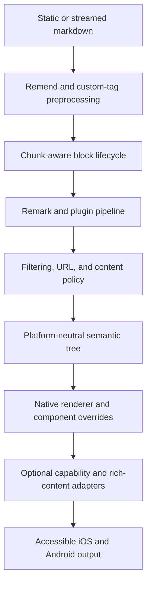
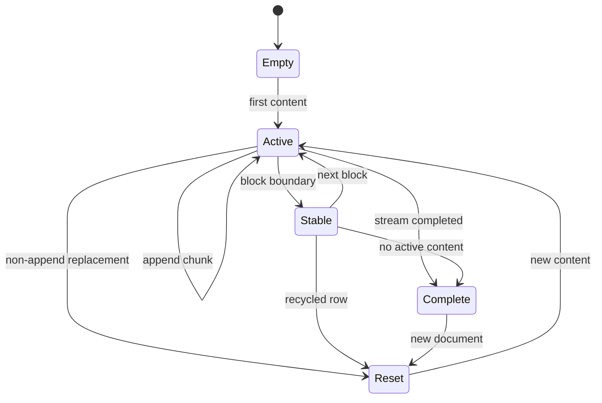
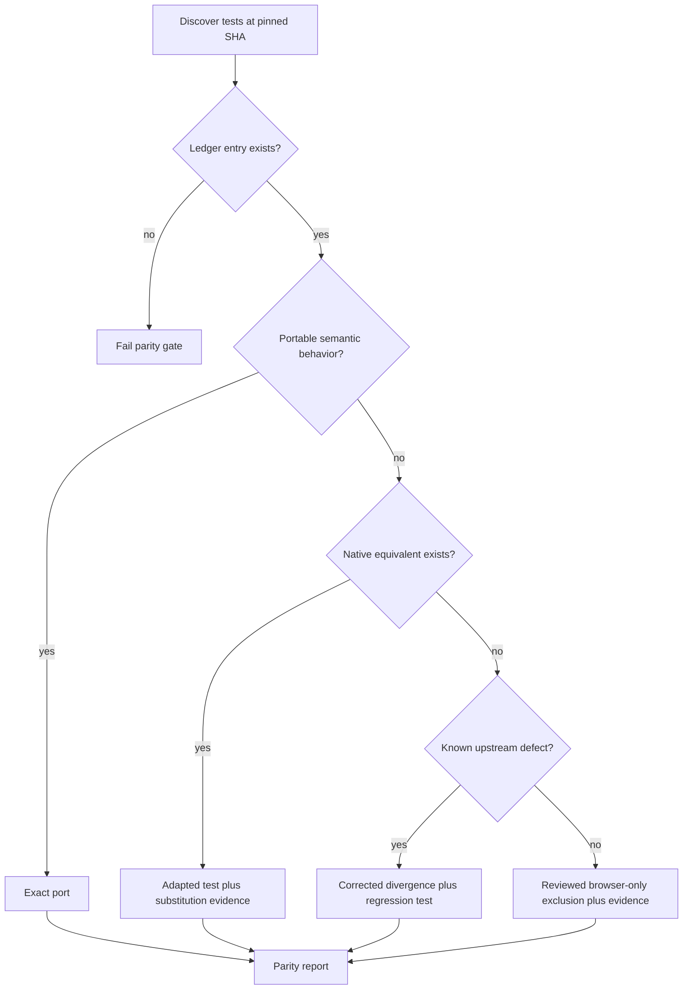

# Streamdown React Native Parity - Plan

## Goal Capsule

- **Objective:** Make `streamdown-rn` a production-ready React Native markdown renderer whose platform-neutral behavior, streaming correctness, security, public API, accessibility, and performance are continuously checked against Vercel Streamdown.
- **Authority:** This plan and its parity ledger define the React Native contract; Vercel Streamdown commit `e5deed330aa4231751a106445d93d62e4716a22f` is the initial upstream oracle, except for recorded upstream defects and browser-only mechanics.
- **Execution profile:** Characterization-first, phased delivery. Each phase leaves the package buildable and releasable.
- **Stop conditions:** Stop and surface a blocker if a claimed parity feature has no secure React Native implementation, an optional renderer cannot pass iOS and Android release-build proof, or a required API choice would silently accept DOM-only values it cannot honor.
- **Tail ownership:** The implementation owns code, tests, packed-package fixtures, benchmark baselines, documentation, parity drift automation, and removal of abandoned experiments.

---

## Product Contract

### Summary

The package will expose a Streamdown-compatible React Native API, preserve observable markdown and streaming behavior through native primitives, and make every upstream test case auditable as an exact port, native adaptation, known-upstream-bug divergence, or evidence-backed browser-only exclusion.

### Problem Frame

The current package has a promising stable-block/active-block split but is not a reliable parity baseline. Its standalone TypeScript config points outside this checkout, its tests cover pure helpers only, its renderer omits or weakens several documented GFM and interaction behaviors, and its streaming splitter repeatedly rescans growing content despite documented constant-cost claims.

Vercel Streamdown 2.5.0 contains the desired behavior and breadth, but its implementation is web-specific: DOM elements, CSS/Tailwind, browser clipboard/download/fullscreen APIs, KaTeX HTML, and Mermaid DOM rendering cannot be copied into React Native. Parity therefore means the same user-visible result and safety contract where the platforms overlap, plus explicit native equivalents or reviewed non-applicability where they do not.

### Actors

- A1. **Library consumer:** Installs the package in a bare React Native or Expo application and configures renderers, themes, plugins, security, and native capabilities.
- A2. **Application user:** Reads streaming or static markdown and interacts with links, media, code, tables, math, and diagrams using touch and assistive technology.
- A3. **Maintainer:** Updates the upstream pin, classifies parity cases, reviews exclusions, evaluates benchmark changes, and publishes releases.

### Requirements

**Compatibility and rendering**

- R1. Export `Streamdown` as the preferred component and retain `StreamdownRN` as a backward-compatible alias, matching upstream prop names and behavior wherever a meaningful native contract exists.
- R2. Render CommonMark, GFM, footnotes, custom and literal tags, component overrides, the existing `[{c:...,p:...}]` registry extension, RTL/CJK text, and incomplete streaming syntax without silently dropping parsed nodes.
- R3. Provide code, CJK, math, Mermaid, and custom-renderer plugin features through optional subpath exports so core installs do not load their heavyweight or native dependencies.

**Streaming and performance**

- R4. Produce the same semantic document for static input and for every chunking of that input, including append, reset, recycled-row, completion, incomplete construct, and error transitions.
- R5. Parse only changing content, keep finalized blocks referentially stable, prevent completed-block rerenders, cap caches, and enforce release-Hermes performance budgets on representative iOS and Android devices.
- R6. Preserve upstream animation, caret, direction, mode, loading, callback, and memoization behavior through native scheduling and reduced-motion-aware primitives.

**Security and native interaction**

- R7. Apply one sink-aware URL and content policy after all user transforms for links, images, custom tags, and injected component props; untrusted raw HTML is inert unless a host supplies an explicit renderer.
- R8. Provide link safety, image states, copy, share/download, table serialization, fullscreen, and pan/zoom through typed native capabilities with deterministic unavailable, denied, cancelled, failed, retry, and streaming-disabled states.
- R9. Expose native roles, names, states, focus behavior, RTL direction, translations, reduced-motion behavior, and coalesced streaming announcements for all interactive and semantic output.

**Parity governance and delivery**

- R10. Account for every test case in the pinned upstream core, Remend, code, CJK, math, and Mermaid suites using a machine-checked parity ledger with a local semantic assertion and evidence for every non-exact classification.
- R11. Keep normal CI deterministic against a pinned SHA, fail when the ledger is incomplete or stale, and report newer upstream `main` changes separately so external drift does not break unchanged pull requests.
- R12. Build and test the packed artifact in the declared React, React Native, Expo, Metro, Hermes, iOS, and Android matrix before widening peer ranges or publishing.
- R13. Keep README, architecture, API, plugin, migration, security, accessibility, performance, and parity documentation aligned with executable behavior and evidence.

### Key Flows

- F1. **Static render**
  - **Trigger:** A1 renders complete markdown.
  - **Actors:** A1, A2
  - **Steps:** The pure pipeline repairs only when enabled, parses and filters the document, resolves plugins and overrides, and emits native semantic nodes.
  - **Outcome:** A2 receives a complete, safe, accessible document with no streaming-only side effects.
- F2. **Streaming render**
  - **Trigger:** A1 appends or replaces streamed content.
  - **Actors:** A1, A2
  - **Steps:** The engine distinguishes append from reset, repairs and parses the active region, preserves finalized blocks, reports animation state, and finalizes on completion.
  - **Outcome:** The rendered semantics match F1 for the same final markdown while completed blocks remain stable.
- F3. **Native interaction and optional content**
  - **Trigger:** A2 opens a link or uses a code, table, image, math, or diagram feature.
  - **Actors:** A1, A2
  - **Steps:** Security and capability checks run before the native effect; optional renderers expose readable loading and fallback states; actions report success, cancellation, denial, or failure.
  - **Outcome:** The feature works without unsafe activation or an inaccessible dead end.
- F4. **Parity update and release**
  - **Trigger:** A3 refreshes the upstream pin or prepares a release.
  - **Actors:** A3
  - **Steps:** Tooling inventories upstream tests, validates every ledger mapping, runs semantic and device gates, checks benchmark budgets, and verifies the packed artifact.
  - **Outcome:** A release can claim parity only for evidence that is present and reproducible.

### Acceptance Examples

- AE1. Given one markdown document and several chunk boundaries, when each stream completes, then every run produces the same semantic native tree as static mode.
- AE2. Given a finalized code block followed by streamed prose, when more prose arrives, then the code block is neither reparsed nor rerendered.
- AE3. Given a recycled list row whose new markdown does not extend its previous content, when the component updates, then all prior block and plugin state resets before rendering the new document.
- AE4. Given a link transformed into a blocked or unresolved URL, when A2 presses it, then no native open call occurs and the configured denial behavior is observable.
- AE5. Given a checked GFM task item, RTL text, an image failure, and an incomplete code fence, when rendered during streaming, then roles, states, direction, fallback text, and busy state remain correct.
- AE6. Given supported and unsupported Mermaid syntax, when the native adapter and full-fidelity adapter render it, then supported native diagrams stay outside a WebView, full syntax is opt-in and sandboxed, and both expose readable failure and retry states.
- AE7. Given an upstream test case with no ledger entry or a bare `N/A`, when parity validation runs, then the gate fails and identifies the unmapped case or missing evidence.
- AE8. Given the packed tarball, when installed in the minimum Expo/RN fixture and a current supported fixture, then Metro bundles every advertised entry point and Hermes renders representative static, streaming, and plugin content.

### Success Metrics

- Every case discovered at the pinned upstream SHA has exactly one reviewed ledger disposition and no duplicate or bare non-applicable entries.
- Exact and adapted parity tests, current package regression tests, native semantic tests, device smoke tests, and packed-install tests pass for all declared platforms.
- Screenshot baselines pass on pinned iOS and Android simulators across light/dark themes, supported font scales, RTL/LTR, narrow/wide layouts, static/streaming states, and every core and optional renderer family; intentional changes require reviewed baseline updates.
- Completed blocks record zero rerenders during progressive append; processor and highlighter caches stay within documented bounds.
- On the declared reference Android device in a release Hermes build, a 10 KB mixed markdown stream delivered in 32-character chunks keeps p95 append-to-commit latency within one 16.67 ms frame; other device results are tracked as same-device regression baselines rather than compared to jsdom.
- Core bundle and startup measurements do not include optional code, CJK, math, or Mermaid renderers until their subpath is imported.

### Scope Boundaries

**In scope**

- React Native iOS and Android, bare React Native, Expo, Metro, Hermes, React 19, and the New Architecture.
- Platform-neutral Streamdown APIs and semantic native equivalents for its official core and companion features.
- Upstream defects recorded as deliberate divergences when copying them would violate correctness, safety, or stated behavior.

**Outside this product's identity**

- DOM output compatibility, CSS/Tailwind class behavior, SSR hydration, browser portals, body scroll locking, object-URL downloads, hover behavior, and React Native Web; web consumers should use Vercel Streamdown.
- Executing arbitrary raw HTML or scripts from markdown.
- A WebView dependency in the core package or implicit WebView use without an explicit plugin import.

#### Deferred to Follow-Up Work

- React Compiler output, until uncompiled behavior and Hermes baselines are stable.
- React Native Testing Library 14, until its replacement renderer is stable rather than release-candidate software.
- Additional framework adapters beyond the minimum Expo/RN fixture and one current supported fixture.

---

## Planning Contract

### Key Technical Decisions

- KTD1. **Native semantic compatibility, not DOM emulation.** `Streamdown` accepts platform-neutral upstream concepts and native component overrides; DOM-only props are omitted or rejected by types instead of accepted and ignored. `StreamdownRN` remains an alias to protect current consumers.
- KTD2. **One package with optional subpath plugins first.** Use `streamdown-rn/code`, `streamdown-rn/cjk`, `streamdown-rn/math`, `streamdown-rn/mermaid`, and `streamdown-rn/renderers` entry points with optional peers rather than converting this standalone repository into a monorepo. Split npm packages only if packed Metro evidence proves subpaths cannot isolate install or bundle cost.
- KTD3. **Reuse portable upstream behavior.** Depend on the published `remend` implementation and reuse upstream block, direction, preprocessing, serializer, and plugin-order semantics where platform-neutral; do not maintain a second incomplete-markdown language without evidence that the dependency is insufficient.
- KTD4. **Pure pipeline plus exhaustive native renderer.** Keep parsing, filtering, sanitization, and serialization independent of React Native, then map every allowed semantic node to native text or block layout. Do not route generic HAST intrinsic names through an HTML JSX runtime.
- KTD5. **Security policy precedes effects.** Revalidate transformed URLs by sink, require a resolver for relative links, default remote images to HTTPS, block data images unless bounded and opted in, and perform link approval before `Linking` or any capability adapter.
- KTD6. **Capability injection for native effects.** Core defines typed copy, share/file, open-link, fullscreen, and gesture capabilities with readable unavailable states. Platform integration lives behind adapters so Expo and bare apps do not inherit each other's native modules.
- KTD7. **Optional renderers earn promotion through device proof.** CJK stays pure AST transformation. Shiki uses its JavaScript ES2018 regex engine only after release-Hermes correctness and memory proof. Math prefers an optional RaTeX native adapter. Mermaid provides a `beautiful-mermaid` plus `react-native-svg` subset adapter and a separately imported, offline, locked-navigation WebView adapter for full official syntax.
- KTD8. **Parity follows semantics, not weak upstream assertions.** The ledger records exact, adapted, browser-only, and known-upstream-bug dispositions. Non-crash coverage tests are strengthened into observable assertions; known stale memo, plugin-cache collision, token-cache collision, and permissive URL behaviors are not copied as desired behavior.
- KTD9. **One production test runner.** Migrate existing Bun and upstream Vitest suites to Jest so pure and React Native Testing Library tests share lifecycle and mocks; benchmarks remain separate release-Hermes workloads.
- KTD10. **Pinned reproducibility with visible drift.** Pull requests validate the committed SHA and ledger; a scheduled check reports upstream changes and generates a reviewable inventory update rather than silently floating the oracle.

### High-Level Technical Design

The design preserves the current stable/active seam while replacing incomplete shared internals with measured, platform-neutral stages.







### Output Structure

```text
src/
  core/                 # repair, parsing, blocks, security, semantic model
  renderers/            # native node families and stable/active blocks
  controls/             # code, table, image, modal, and capability UI
  platform/             # typed native capability boundary
  plugins/              # code, CJK, math, Mermaid, custom renderers
  __tests__/             # pure and native semantic behavior
parity/
  upstream.json         # pinned repository, SHA, versions, license
  manifest.json         # case-level parity ledger
scripts/parity/         # inventory, validation, and drift reporting
tests/
  parity/               # ledger and upstream semantic gates
  package/              # packed tarball and export resolution
  device/               # iOS/Android interaction and accessibility smoke
benchmarks/              # parser, streaming, render, memory, bundle workloads
fixtures/
  expo54/               # minimum declared compatibility host
  current-rn/           # current supported React Native host
docs/                   # API, plugins, parity, security, accessibility, performance
```

### Sequencing

Build the executable test and package baseline before porting behavior. Establish the parity ledger before broad feature work so every implementation unit has a visible upstream target. Land parsing and security before native interactions, then streaming correctness before optimization. Optional renderers and device performance gates come after the core native contract is stable.

---

## Implementation Units

| Unit | Title | Primary files | Depends on |
|---|---|---|---|
| U1 | Standalone build and native test baseline | `package.json`, `tsconfig.json`, `jest.config.*`, `tests/package/` | None |
| U2 | Upstream parity oracle and ledger | `parity/`, `scripts/parity/`, `tests/parity/` | U1 |
| U3 | Portable parsing and block semantics | `src/core/`, `src/__tests__/parity/core/` | U1, U2 |
| U4 | Security and filtering boundary | `src/core/sanitize.ts`, `src/core/security/` | U3 |
| U5 | Native renderer and compatible API | `src/index.ts`, `src/StreamdownRN.tsx`, `src/renderers/` | U3, U4 |
| U6 | Streaming lifecycle, animation, and memoization | `src/core/splitter/`, `src/renderers/ActiveBlock.tsx`, `src/renderers/StableBlock.tsx` | U3, U5 |
| U7 | Native controls and accessibility | `src/controls/`, `src/platform/`, `src/themes/` | U4, U5, U6 |
| U8 | Code, CJK, and custom renderers | `src/plugins/code/`, `src/plugins/cjk/`, `src/plugins/renderers/` | U3, U5, U6 |
| U9 | Math and Mermaid adapters | `src/plugins/math/`, `src/plugins/mermaid/` | U3, U5, U7 |
| U10 | Device compatibility and performance gates | `fixtures/`, `tests/device/`, `benchmarks/` | U6, U7, U8, U9 |
| U11 | Documentation, CI, and release parity | `README.md`, `ARCHITECTURE.md`, `docs/`, `.github/workflows/` | U2-U10 |

### U1. Standalone build and native test baseline

- **Goal:** Make this checkout independently buildable, testable, and installable before behavior changes begin.
- **Requirements:** R12, R13
- **Dependencies:** None
- **Files:** Modify `package.json`, `tsconfig.json`, `src/__tests__/*.test.ts`; create `jest.config.*`, `tests/setup.ts`, `tests/package/exports.test.ts`, `fixtures/expo54/`, and the minimum build configuration.
- **Approach:** Replace the missing parent TypeScript config with owned settings, use one Jest/RNTL runner, add explicit export conditions and packed-tarball verification, and preserve current public exports as a characterized baseline.
- **Execution note:** Start with failing build, type, import, and packed-install checks; do not begin parity features until they are executable.
- **Patterns to follow:** Existing package scripts and TypeScript strictness; React Native public imports only.
- **Test scenarios:**
  - Build from a clean checkout and verify declarations and runtime entries resolve without an external parent config.
  - Import every current public symbol from the packed tarball and verify no source-only path is required.
  - Install the tarball into a minimal Metro fixture and verify `react-native` and default export conditions resolve.
  - Run the migrated 201 current cases under Jest and preserve their current pass/fail semantics before refactoring.
- **Verification:** Build, type-check, Jest discovery, and packed-artifact imports work from this repository alone.

### U2. Upstream parity oracle and ledger

- **Goal:** Turn the pinned upstream source and tests into a deterministic, machine-audited parity contract.
- **Requirements:** R10, R11, R13; F4; AE7
- **Dependencies:** U1
- **Files:** Create `parity/upstream.json`, `parity/manifest.json`, `parity/README.md`, `scripts/parity/inventory.ts`, `scripts/parity/validate.ts`, `scripts/parity/check-drift.ts`, `tests/parity/manifest.test.ts`, and upstream attribution/notice updates.
- **Approach:** Inventory test path plus case identity at the pinned SHA, record exact/adapted/browser-only/known-bug dispositions with target test and evidence, reject duplicates and bare exclusions, and separate deterministic validation from scheduled drift reporting.
- **Patterns to follow:** Vercel Streamdown package/test layout at the pinned commit; Apache-2.0 attribution requirements.
- **Test scenarios:**
  - Remove one upstream case mapping and expect validation to identify the missing path and case.
  - Duplicate one mapping and expect validation to reject the ambiguous target.
  - Mark a case non-applicable without platform evidence and expect validation to fail.
  - Record a known upstream defect and require both the upstream evidence and a local corrected regression test.
  - Compare the pin with unchanged and advanced upstream `main`; unchanged reports clean, advanced reports drift without failing ordinary pinned validation.
- **Verification:** The ledger accounts for every case discovered at `e5deed330aa4231751a106445d93d62e4716a22f` and can be refreshed reproducibly.

### U3. Portable parsing and block semantics

- **Goal:** Match upstream repair, CommonMark/GFM parsing, block partitioning, tag preprocessing, plugin order, direction, footnote, and serializer behavior before native presentation.
- **Requirements:** R2, R3, R4, R10; F1, F2; AE1, AE3
- **Dependencies:** U1, U2
- **Files:** Modify `src/core/parser.ts`, `src/core/incomplete.ts`, `src/core/splitter/`, `src/core/types.ts`; create focused modules under `src/core/`, `src/__tests__/parity/core/`, and `src/__tests__/parity/remend/`.
- **Approach:** Use published Remend, port platform-neutral upstream utilities, preserve document-wide constructs when partitioning, remove the setext-heading rewrite, return all top-level nodes, and define a semantic model that does not depend on DOM props.
- **Execution note:** Add characterization coverage for current behavior, then drive portable upstream suites test-first in coherent parser families.
- **Patterns to follow:** Upstream Remend handlers, block parsing, CJK plugin order, custom/literal preprocessing, and table serializers; retain pure-function boundaries from current `src/core/`.
- **Test scenarios:**
  - Port every Remend case for incomplete emphasis, code, links, images, lists, HTML-like text, math delimiters, custom handlers, and broken variants.
  - Parse headings including setext, nested lists and task items, aligned tables, footnotes, autolinks, hard breaks, code metadata, raw HTML text, and multiple top-level nodes without loss.
  - Partition footnotes, math, fenced code, tables, nested custom tags, and blank-line content without changing whole-document semantics.
  - Feed every chosen chunk boundary, empty append, non-append replacement, and completion signal and compare the final semantic tree with static parsing.
  - Supply plugins in the documented before/default/after/math order and verify same-named functions do not collide in caches.
- **Verification:** Exact-port parser suites and chunk-invariance tests pass with no renderer involved.

### U4. Security and filtering boundary

- **Goal:** Make untrusted markdown and all native activation paths share one explicit, tested policy.
- **Requirements:** R7, R8, R10; F1, F3; AE4
- **Dependencies:** U3
- **Files:** Modify `src/core/sanitize.ts`, `src/core/componentParser.ts`; create `src/core/security/`, `src/__tests__/parity/security/`, and `src/__tests__/security-policy.test.ts`.
- **Approach:** Apply allowed/disallowed element filtering, custom-tag attributes, skip/unwrap rules, and URL transforms at the semantic-tree boundary; revalidate transformed values by sink; keep raw HTML inert by default; sanitize registry props recursively before validation and rendering.
- **Patterns to follow:** Current centralized `sanitizeURL`/`sanitizeProps`; upstream sanitize/filter/link-safety intent, corrected for native sinks.
- **Test scenarios:**
  - Accept declared HTTP, HTTPS, mail, telephone, and SMS link schemes; reject script, file, content, control-character, encoded, and undeclared custom schemes.
  - Require a host resolver before activating relative URLs; preserve inert readable link text when none exists.
  - Accept HTTPS images by default, reject unsafe/data images unless bounded opt-in policy permits their MIME and size, and recheck `urlTransform` output.
  - Filter or unwrap allowed/disallowed elements exactly as configured without bypass through custom or literal tags.
  - Reject unsafe nested registry props and surface registry validation/render errors through the configured error boundary.
- **Verification:** No link, image, custom component, or native capability receives an unvalidated external value.

### U5. Native renderer and compatible API

- **Goal:** Expose the Streamdown-compatible component surface and render every supported semantic node with correct React Native text/block composition.
- **Requirements:** R1, R2, R3, R9, R10; F1, F3; AE5
- **Dependencies:** U3, U4
- **Files:** Modify `src/index.ts`, `src/StreamdownRN.tsx`, `src/core/types.ts`, `src/renderers/ASTRenderer.tsx`, `src/themes/index.ts`; create node-family modules under `src/renderers/` and tests under `src/renderers/__tests__/`.
- **Approach:** Export `Streamdown` and the compatibility alias, map platform-neutral upstream props to native equivalents, keep the existing component registry additive, split the monolithic renderer by node family, and remove default `flex: 1` layout ownership.
- **Patterns to follow:** Current theme token seam and stable/active renderers; upstream component override precedence and public type names where meaningful.
- **Test scenarios:**
  - Import `Streamdown`, default, and `StreamdownRN`; render identical content and verify compatible output and types.
  - Render every CommonMark/GFM node family, footnote, custom tag, literal tag, inline code, and unknown-node fallback without dropping siblings.
  - Override block and inline nodes, including `inlineCode`, and verify custom renderer props contain native semantic data rather than DOM attributes.
  - Change theme, style, registry, components, callbacks, plugins, and filtering props without changing children and verify affected output updates instead of remaining stale.
  - Render nested inline text only under `Text` and block content under native layout containers, with no raw string beneath `View`.
- **Verification:** The public API is source-compatible where promised, DOM-only concepts fail clearly, and native semantic snapshots/queries cover every supported node.

### U6. Streaming lifecycle, animation, and memoization

- **Goal:** Make streaming output chunk-invariant and measurably incremental while matching static/streaming modes, carets, callbacks, and animation semantics.
- **Requirements:** R4, R5, R6, R10; F2; AE1, AE2, AE3
- **Dependencies:** U3, U5
- **Files:** Modify `src/StreamdownRN.tsx`, `src/core/splitter/`, `src/renderers/ActiveBlock.tsx`, `src/renderers/StableBlock.tsx`; create `src/core/streaming/`, `src/renderers/__tests__/streaming.test.tsx`, and instrumentation helpers under `benchmarks/`.
- **Approach:** Track append cursors and incomplete construct state incrementally, finalize immutable blocks once, reset on replacement, use stable module defaults, compare every render-bearing input, and animate only newly visible content with reduced-motion support.
- **Execution note:** Prove semantic and render-count invariants before optimizing; accept an optimization only when release-Hermes measurements improve without changing output.
- **Patterns to follow:** Current stable/active boundary; upstream module-stable defaults, previous-character animation tracking, static-mode suppression, and incomplete-fence loading states.
- **Test scenarios:**
  - Covers F2 / AE1. Stream the same mixed document by character, token, line, random chunk, and whole value; compare completed semantics to static mode.
  - Covers AE2. Append after several finalized blocks and assert zero parser calls and renders for those blocks.
  - Covers AE3. Replace content with shorter, unrelated, or same-prefix text and verify cursor, cache, animation, registry, and active-block state reset correctly.
  - Toggle static/streaming mode, completion, caret, animation config, and callbacks; verify start/end callbacks fire once and static mode suppresses them.
  - Stream lists, code, math, custom tags, and fast bursts; verify prior content does not reanimate and incomplete heavy renderers remain deferred.
- **Verification:** Chunk invariance, reset correctness, zero stable-block rerenders, and bounded cache instrumentation are executable gates.

### U7. Native controls and accessibility

- **Goal:** Deliver link, image, code, table, share/download, fullscreen, pan/zoom, translation, icon, and accessibility behavior through native capabilities.
- **Requirements:** R8, R9, R10; F3; AE4, AE5
- **Dependencies:** U4, U5, U6
- **Files:** Create `src/controls/`, `src/platform/capabilities.ts`, `src/platform/defaults.ts`, and `src/controls/__tests__/`; modify `src/themes/index.ts` and relevant renderer nodes.
- **Approach:** Keep capability interfaces in core, provide dependency-free native defaults where React Native supports them, add opt-in adapters for clipboard/filesystem/gestures, and model unavailable, denied, cancelled, failed, busy, expanded, and retry states explicitly.
- **Patterns to follow:** Upstream controls and translations as behavioral references; RN roles, labels, hints, state, modal, Linking, Share, and reduced-motion APIs.
- **Test scenarios:**
  - Approve, deny, cancel, and fail link safety checks; verify `Linking` runs only after approval and failures reach accessible feedback.
  - Copy and serialize code/tables as text, CSV, TSV, and Markdown; verify Unicode/BOM behavior and unavailable/cancelled adapter states.
  - Load, fail, retry, and hide actions for images; verify alt text, decorative-image behavior, dimensions, and unsafe-source denial.
  - Open and dismiss table/diagram fullscreen views by control, system back, and accessibility action; verify focus restoration and scroll/gesture boundaries.
  - Query headings, links, images, buttons, task checkboxes, busy streaming regions, expanded modals, and translated labels by role/name/state.
  - Enable screen-reader announcements during rapid streaming and verify updates are opt-in, coalesced, and do not announce each token.
- **Verification:** RNTL proves semantic and interaction contracts; device smoke scenarios cover native effects and VoiceOver/TalkBack behavior.

### U8. Code, CJK, and custom renderers

- **Goal:** Match upstream highlighted-code, CJK punctuation, code metadata, line-number, loading, and custom language renderer behavior without burdening core.
- **Requirements:** R2, R3, R5, R8, R10; F3
- **Dependencies:** U3, U5, U6
- **Files:** Create `src/plugins/code/`, `src/plugins/cjk/`, `src/plugins/renderers/`, their subpath entry files, and `src/plugins/__tests__/code-cjk.test.tsx`; modify `package.json` exports and optional peers.
- **Approach:** Define a token-provider contract, preserve plain-code fallback, test Shiki core with the JavaScript ES2018 regex engine on Hermes before making it the advertised highlighter, keep CJK AST transforms portable, and preserve custom renderer precedence over ordinary code.
- **Execution note:** The Shiki adapter begins as a release-Hermes compatibility and resource spike; ship it only after correctness, startup, heap, and long-block thresholds pass.
- **Patterns to follow:** Upstream code/CJK plugin contracts, code metadata and line numbering, incomplete-fence context, lazy language/theme loading, and custom renderer precedence; correct upstream cache-key weaknesses.
- **Test scenarios:**
  - Port code and CJK companion suites for supported languages, themes, punctuation boundaries, autolinks, emphasis, and strikethrough.
  - Render unsupported, empty, incomplete, large, and metadata-bearing code blocks with readable fallback, custom start lines, and disabled actions while streaming.
  - Configure custom renderer language arrays and verify they win over default code, receive incomplete state and raw metadata, and update when configuration changes.
  - Highlight two same-length snippets with identical prefixes/suffixes but different middles and verify caches never return the wrong tokens.
  - Bundle core without importing plugin subpaths and verify Shiki/CJK code is absent; import each subpath and verify Metro resolution.
- **Verification:** Exact plugin semantics pass in pure tests, native code output passes semantic tests, and Shiki is advertised only after release-device proof.

### U9. Math and Mermaid adapters

- **Goal:** Provide secure, optional math and diagram rendering with full readable fallback and an explicit path to full upstream syntax.
- **Requirements:** R3, R5, R8, R9, R10; F3; AE6
- **Dependencies:** U3, U5, U7, U8
- **Files:** Create `src/plugins/math/`, `src/plugins/mermaid/`, subpath entries, `src/plugins/__tests__/math.test.tsx`, `src/plugins/__tests__/mermaid.test.tsx`, and adapter device scenarios under `tests/device/`.
- **Approach:** Reuse remark-math parsing, prefer optional RaTeX native output, preserve source text when unavailable, render supported Mermaid families through `beautiful-mermaid` and sanitized `react-native-svg`, and expose a separately imported offline WebView adapter for full Mermaid/KaTeX fidelity with strict navigation, messaging, size, time, and link limits.
- **Patterns to follow:** Upstream plugin/config/error/retry/custom-renderer contracts; RaTeX compatibility guidance; Mermaid strict-security intent without assuming DOMPurify protects native SVG or WebView bridges.
- **Test scenarios:**
  - Port math and Mermaid companion contract cases for plugin identity, parser ordering, configuration, rendering, errors, retries, and incomplete streams.
  - Configure a custom renderer for Mermaid and verify it takes precedence over the built-in native and WebView adapters.
  - Render inline/block math, matrices, currency text, incomplete delimiters, unsupported commands, and large expressions through native and fallback paths.
  - Render every `beautiful-mermaid` supported family, reject or route unsupported syntax explicitly, and sanitize SVG text, attributes, URIs, links, and oversized output.
  - Render official Mermaid syntax in the opt-in WebView adapter with offline assets, navigation disabled, strict security, bounded messages, timeout, retry, and teardown on unmount.
  - Use fullscreen, copy/share, pan/zoom, cancellation, reduced motion, and screen readers on both platforms without losing readable source fallback.
- **Verification:** Native subset and full-fidelity adapters pass semantic and device gates; core and unrelated subpaths do not resolve their optional dependencies.

### U10. Device compatibility and performance gates

- **Goal:** Prove installed-package behavior and performance on the minimum and current supported native stacks.
- **Requirements:** R5, R6, R8, R9, R12; F2, F3, F4; AE8
- **Dependencies:** U6, U7, U8, U9
- **Files:** Modify `fixtures/expo54/`; create `fixtures/current-rn/`, `tests/device/`, `tests/visual/`, reviewed screenshot baselines and diff artifacts, `benchmarks/corpus/`, `benchmarks/parser.bench.ts`, `benchmarks/streaming.bench.tsx`, and benchmark result schema/documentation.
- **Approach:** Install the packed tarball, not workspace source; test Expo SDK 54/RN 0.81 as the minimum floor plus one current supported RN/Expo host; run release Hermes workloads, deterministic screenshot comparisons, and device interaction/accessibility smoke on iOS and Android.
- **Patterns to follow:** Upstream five benchmark workloads adapted to native semantics; RN release profiling, Android System Trace, and Xcode Instruments guidance.
- **Test scenarios:**
  - Bundle and launch every core/plugin subpath from the packed artifact in both fixtures without deep RN imports or consumer compiler assumptions.
  - Render static and streamed corpora containing prose, long code, GFM tables/lists, links/images, math, diagrams, RTL/CJK, and incomplete constructs.
  - Capture and compare screenshots on pinned iOS and Android simulators for light/dark themes, supported font scales, RTL/LTR, narrow/wide layouts, static output, deterministic streaming checkpoints, loading/error/fallback states, fullscreen content, and every core and optional renderer family.
  - Fail visual comparisons outside the documented pixel-difference threshold, retain diff artifacts in CI, and require explicit review when updating baselines; pair each screenshot with semantic assertions so a visually unchanged accessibility regression cannot pass.
  - Record parser CPU, React commits, stable-block rerenders, p50/p95 append-to-commit latency, JS/UI dropped frames, heap/cache ceilings, first render, and bundle/startup impact.
  - Run link, clipboard/share/file, image, scroll, modal, gesture, code, math, and diagram smoke on iOS and Android release builds.
  - Manually verify VoiceOver on hardware and TalkBack on Android for reading order, roles, names, state, focus restoration, and coalesced streaming announcements.
- **Verification:** The declared matrix passes packed-install, screenshot regression, native effect, accessibility, and benchmark budgets; peer ranges reflect only proven hosts.

### U11. Documentation, CI, and release parity

- **Goal:** Make parity claims, installation, configuration, limitations, evidence, and release gates discoverable and continuously enforced.
- **Requirements:** R10, R11, R12, R13; F4
- **Dependencies:** U2-U10
- **Files:** Modify `README.md`, `ARCHITECTURE.md`, `CHANGELOG.md`, `src/__tests__/README.md`, `package.json`; create `docs/api.md`, `docs/plugins.md`, `docs/parity.md`, `docs/security.md`, `docs/accessibility.md`, `docs/performance.md`, migration guidance, and `.github/workflows/` checks.
- **Approach:** Replace aspirational claims with links to executable gates, document exact/adapted/browser-only semantics, publish plugin and capability installation recipes, run deterministic CI on the pin, schedule upstream drift reports, and require changesets plus packed-release proof.
- **Patterns to follow:** Upstream documentation topic coverage and Changesets workflow, corrected where upstream docs and source disagree.
- **Test scenarios:**
  - Validate every documented import and configuration example against public types and packed exports.
  - Verify documentation never claims a plugin is built in when it is optional or a native subset is full Mermaid support.
  - Run CI with an incomplete ledger, failing semantic test, missing optional peer, bundle regression, and advanced upstream SHA; expect the correct blocking or reporting behavior for each.
  - Generate a release report containing pinned SHA, ledger totals by disposition, known divergences, compatibility matrix, benchmark deltas, and remaining deferred work.
- **Verification:** A maintainer can reproduce every claim and cannot publish when parity, security, package, device, or performance gates fail.

---

## System-Wide Impact

- **Public API:** Adds the preferred `Streamdown` export and broadens configuration while retaining current aliases and registry behavior.
- **Rendering:** Replaces a monolithic partial MDAST renderer with a complete semantic model and native node families; text/layout nesting becomes an explicit invariant.
- **Security:** Moves URL and content decisions ahead of every native effect and optional renderer, including transformed URLs and SVG/WebView bridges.
- **Performance:** Changes splitter, parser cache, memoization, lazy plugin loading, animation, and benchmark posture; claims depend on release-Hermes evidence rather than Node timing.
- **Packaging:** Introduces subpath exports, optional peers, packed-install fixtures, and a supported runtime matrix while keeping core pure JS.
- **Maintenance:** Adds an upstream pin, machine-readable ledger, scheduled drift signal, and known-divergence governance.

---

## Risks and Dependencies

| Risk | Impact | Mitigation |
|---|---|---|
| The upstream suite is large and changes frequently | Porting can become an unreviewable big bang | Land suite families behind one ledger, keep every phase releasable, and separate drift reporting from pinned CI |
| Upstream tests encode DOM details or weak non-crash assertions | Passing copied tests could overstate parity | Map semantic intent, require native substitute evidence, and strengthen known weak cases |
| Current splitter and caches have hidden correctness/performance defects | Optimizations can preserve wrong behavior or corrupt output | Characterize static/chunk invariance first, key caches by full behavior inputs, and benchmark only corrected semantics |
| Shiki compatibility on Hermes is unproven | Bundle, startup, memory, or regex failures | Gate the optional adapter on release-device proof and keep plain-code fallback |
| Native math and Mermaid dependencies fragment Expo/bare support | Install failures or forced native builds | Isolate optional peers by subpath, test packed fixtures, and keep readable source fallback |
| Full Mermaid/KaTeX WebView adapters process untrusted content | Script, navigation, bridge, and resource abuse | Offline assets, explicit import, strict CSP/navigation/message allowlists, complexity/time/size caps, teardown, and device security tests |
| Accessibility differs between JS tests and native platforms | Semantically passing components may remain unusable | Pair RNTL assertions with VoiceOver/TalkBack device proof and documented manual checks |
| Universal timing budgets are hardware-sensitive | Flaky or misleading performance gates | Use one declared reference threshold plus same-device regression baselines and profiler evidence |
| Copied upstream cases and third-party adapters carry license duties | Release or attribution risk | Record source SHA and Apache attribution; audit MIT and native dependency licenses before publication |

---

## Verification Contract

| Gate | Command or evidence | Applies to | Done signal |
|---|---|---|---|
| Types and build | `bun run type-check`, `bun run build` | Every unit | Strict build and declarations succeed from this checkout |
| Semantic/native tests | `bun run test` | U1-U9 | Jest pure and RNTL suites pass |
| Parity ledger | `bun run test:parity` | U2-U11 | Every pinned case maps exactly once with valid evidence |
| Packed artifact | `bun run pack:verify` | U1, U5, U8-U11 | Tarball exports install and bundle in both fixtures |
| Native smoke | `bun run test:device` plus platform reports | U7-U10 | iOS and Android native effects and accessibility scenarios pass |
| Visual regression | `bun run test:visual` plus retained diff artifacts | U5-U10 | Pinned iOS and Android screenshots match reviewed baselines across the declared visual matrix |
| Hermes performance | `bun run benchmark:hermes` plus profiler artifacts | U6, U8-U10 | Stable-block, latency, memory, frame, startup, and bundle budgets pass |
| Upstream drift | `bun run parity:drift` | U2, U11 | Scheduled report identifies additions/removals without changing the committed pin |
| Documentation | `bun run docs:verify` | U11 | Examples compile and claims link to current gates |

---

## Definition of Done

- Product requirements R1-R13 and acceptance examples AE1-AE8 are enforced by the named implementation units and verification gates.
- All cases at the pinned upstream SHA have one validated parity disposition; browser-only and known-bug entries carry evidence and substitute or corrected tests.
- `Streamdown` and `StreamdownRN` render equivalent static and completed streaming semantics across the declared compatibility matrix.
- Core, native controls, code/CJK, math, and Mermaid features pass security, accessibility, interaction, packaging, and release-Hermes evidence appropriate to their platform mechanism.
- Reviewed screenshot baselines cover both platforms, themes, supported font scales, directionality, representative viewport sizes, streaming checkpoints, interaction states, and all renderer families, with CI retaining actionable diffs.
- Performance budgets pass with zero finalized-block rerenders and no uncapped processor, token, diagram, or image cache.
- The packed artifact, not workspace source, installs and bundles in the minimum and current fixtures.
- Documentation states exact limitations and never claims DOM mechanics, native coverage, plugin inclusion, or full syntax support without evidence.
- Scheduled upstream drift reporting and deterministic pinned CI are active.
- Experimental branches, unused adapters, stale docs, generated benchmark scratch data, and abandoned implementation attempts are removed from the final diff.

---

## Appendix

### Sources and Research

- Current package: `src/StreamdownRN.tsx`, `src/core/`, `src/renderers/ASTRenderer.tsx`, `src/__tests__/`, `package.json`, `tsconfig.json`, `README.md`, and `ARCHITECTURE.md`.
- [Vercel Streamdown pinned source](https://github.com/vercel/streamdown/tree/e5deed330aa4231751a106445d93d62e4716a22f), including core 2.5.0, Remend 1.3.0, official companion packages, tests, benchmarks, and docs.
- [React Native 0.81 testing overview](https://reactnative.dev/docs/0.81/testing-overview), [accessibility](https://reactnative.dev/docs/0.81/accessibility), [performance](https://reactnative.dev/docs/0.81/performance), [profiling](https://reactnative.dev/docs/0.81/profiling), and [Hermes](https://reactnative.dev/docs/0.81/hermes).
- [Expo SDK 54 compatibility](https://expo.dev/changelog/sdk-54) and [React Native stable JavaScript API guidance](https://reactnative.dev/blog/2025/06/12/moving-towards-a-stable-javascript-api).
- [React Compiler for libraries](https://react.dev/reference/react-compiler/compiling-libraries) and [React Native Testing Library](https://callstack.github.io/react-native-testing-library/docs/start/quick-start).
- [Shiki regex engines](https://shiki.style/guide/regex-engines), [RaTeX](https://github.com/erweixin/RaTeX), [beautiful-mermaid](https://github.com/lukilabs/beautiful-mermaid), and [Mermaid security](https://mermaid.ai/open-source/community/security.html).
