# Streamdown RN examples

Real iOS Simulator captures and host performance characterizations generated from this repository.

## Generate everything

```sh
bun run examples:all
```

`examples:ios` runs `bun run sample:ios`, installs the packed package in an Expo 56 Release build, then captures nine feature states from the booted simulator. Reuse the installed build with:

```sh
bun run examples:ios -- --skip-build
```

On a fresh iOS 26 simulator, approve the one-time **Open in streamdown-rn-expo56-fixture?** prompt, then rerun the `--skip-build` command so the prompt is not included in the captures.

## Visual examples

| Feature | Capture |
|---|---|
| Core Markdown, GFM, code, math, Mermaid, CJK | [Feature tour](ios/streamdown-feature-tour.mov) |
| Core Markdown | 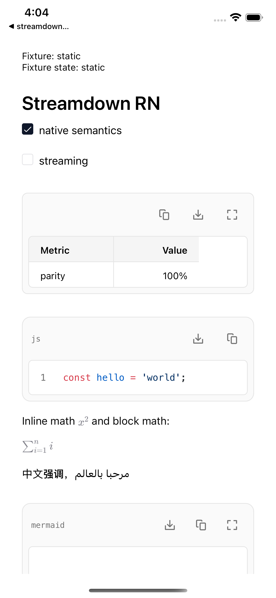 |
| Syntax highlighting | 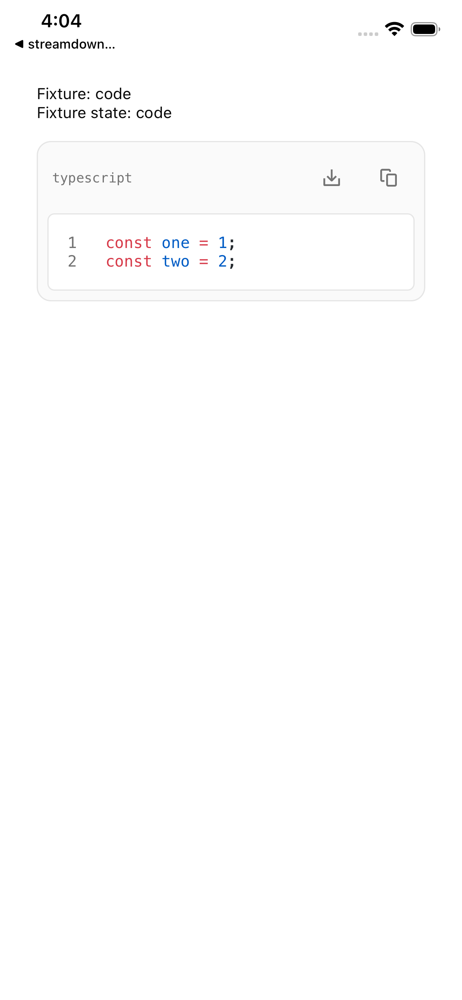 |
| Native math | 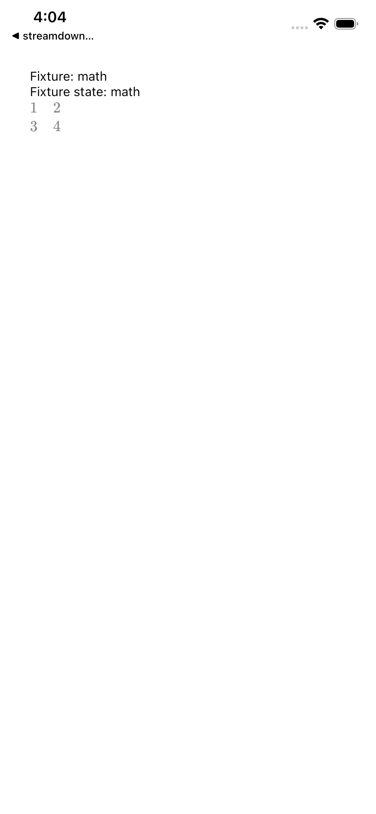 |
| Mermaid | 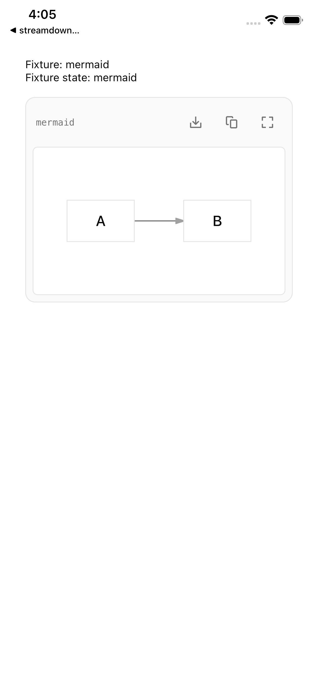 |
| Vega-Lite custom renderer | 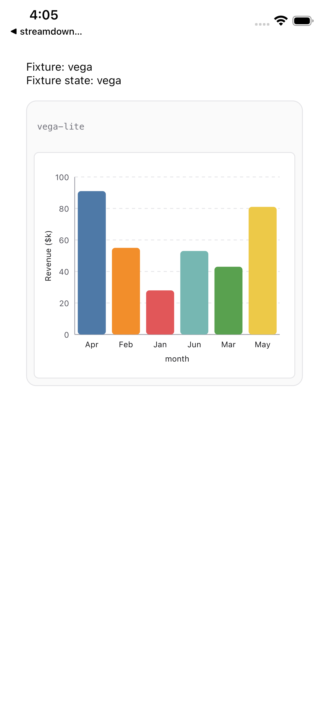 |
| Streaming checkpoint | 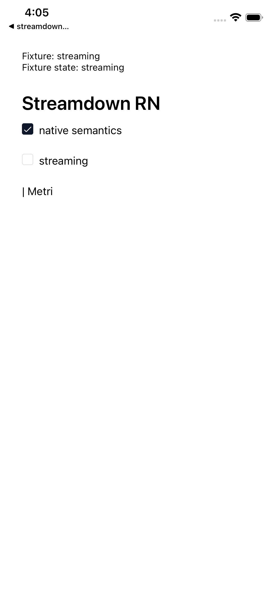 |
| Native fallbacks | 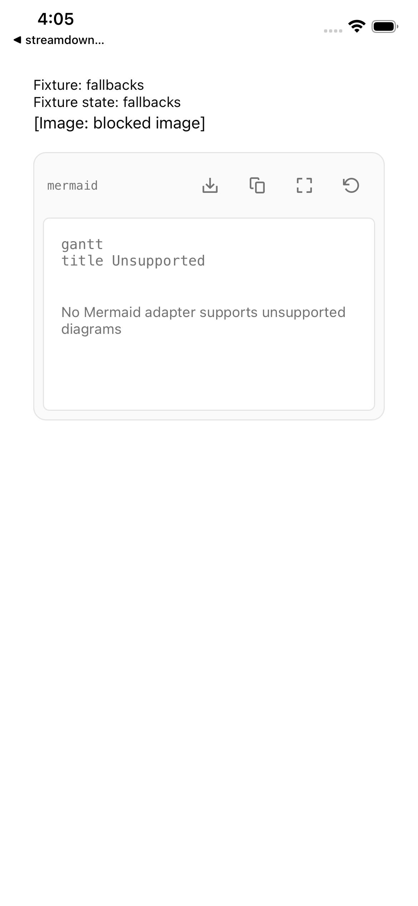 |
| Interactive harness | 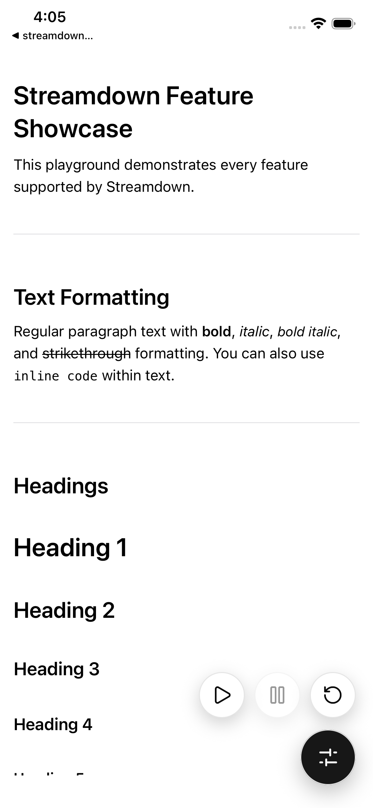 |

Capture provenance is recorded in [`ios/capture.json`](ios/capture.json).
The feature-tour video is the manually recorded iOS showcase supplied with this repository; screenshot regeneration does not overwrite it.

## Performance examples

```sh
bun run examples:metrics
```

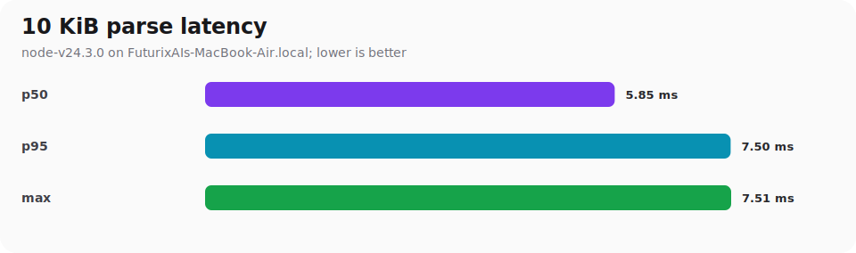

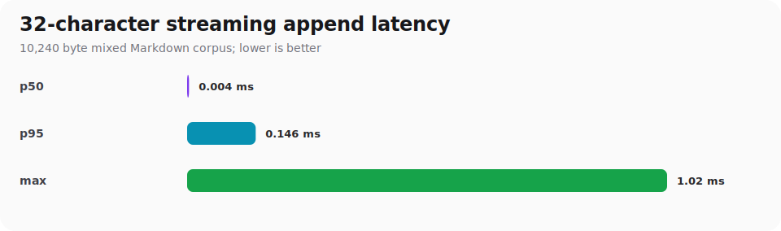

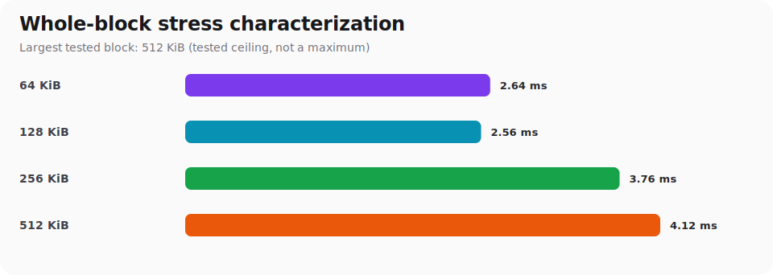

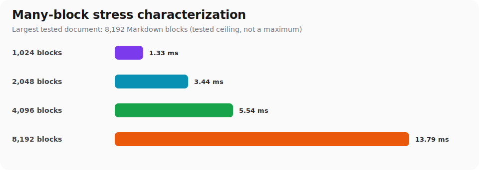

Raw values and tested ceilings are in [`performance/host-metrics.json`](performance/host-metrics.json). These are host Node characterizations, not physical-device Hermes, frame, heap, or startup measurements. The largest successful test is a tested ceiling—not the package's maximum supported content length.

The current renderer's default safety limit is 2,097,152 UTF-16 code units (`maxInputLength` can lower or explicitly raise it). This run exercised single blocks through 512 KiB, incremental 32-character streaming through 512 KiB, and documents through 8,192 Markdown blocks.
